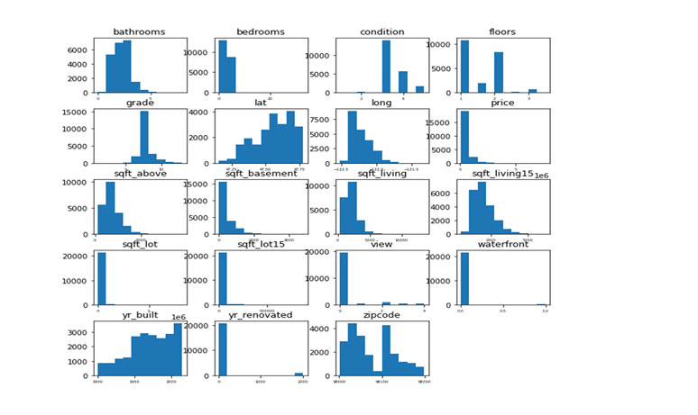
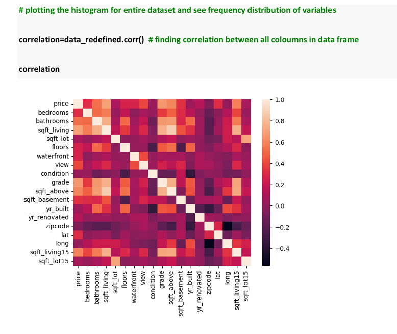
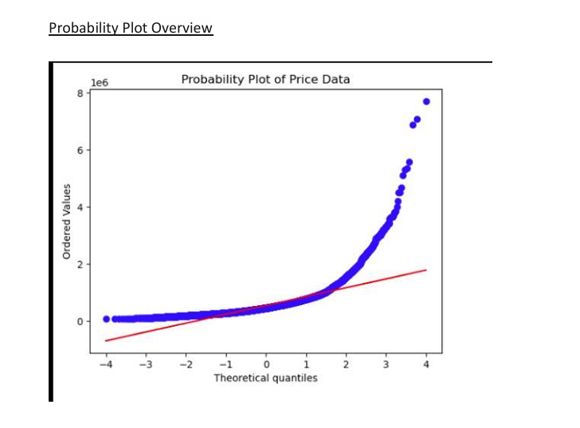
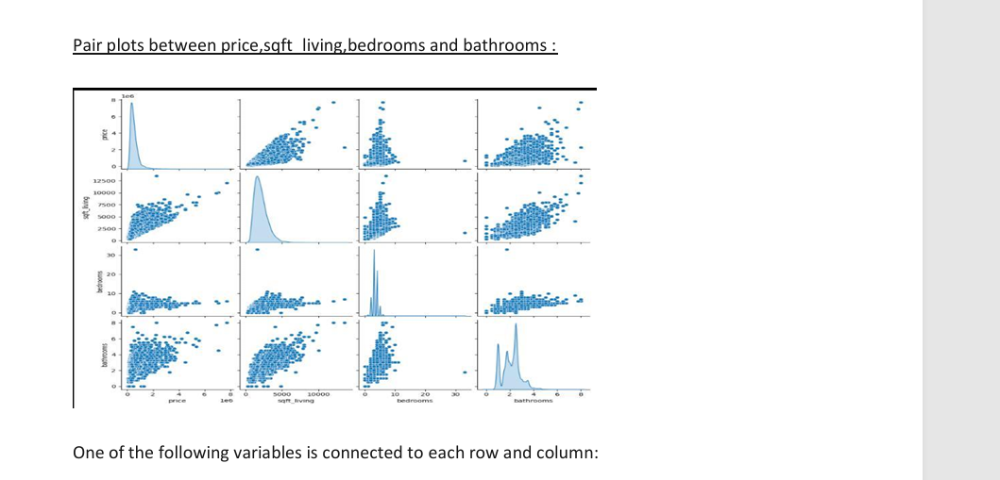
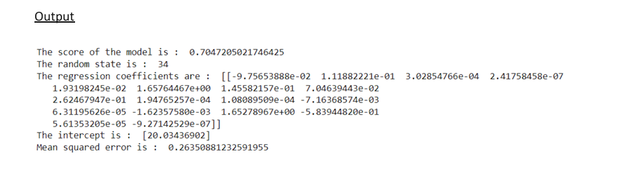

# House Price Prediction Using R & Python

## Project Overview
This project focuses on predicting housing prices using statistical modeling and machine learning techniques on the King County, Washington housing dataset.

The objective was to identify the key factors affecting property prices and build predictive models capable of forecasting house values accurately.

The project applied:
- Multiple Linear Regression
- Decision Tree Regression
- Data Visualization
- Correlation Analysis
- Feature Engineering
- Predictive Analytics

to analyze real estate pricing patterns and improve prediction accuracy.

---

## Business Problem
Accurate house price prediction is critical for:
- Real estate investors
- Home buyers
- Urban planners
- Financial institutions
- Policymakers

Traditional prediction models often struggle with:
- market complexity
- outliers
- feature relationships
- changing economic conditions

This project aimed to improve housing price forecasting using statistical and machine learning techniques.

---

## Research Question
Can machine learning and regression techniques improve the accuracy and reliability of house price prediction models compared to traditional approaches?

---

## Dataset Information

### Dataset Used
King County Housing Dataset (Washington, USA)

### Dataset Size
- 21,613 records
- 21 variables

### Features Included
- Bedrooms
- Bathrooms
- Square Footage
- Waterfront
- Floors
- Grade
- Condition
- Year Built
- Zipcode
- Latitude & Longitude

---

## Technologies & Tools Used

### Programming Languages
- R
- Python

### Libraries Used
- Pandas
- NumPy
- Matplotlib
- Seaborn
- Scikit-learn

---

## Data Preprocessing

The project involved:
- Removing unnecessary features
- Data cleaning
- Null value validation
- Feature selection
- Correlation analysis
- Data normalization
- Outlier analysis

---

## Exploratory Data Analysis (EDA)

EDA techniques included:
- Histograms
- Correlation heatmaps
- Pair plots
- Probability plots
- Scatter plots
- Distribution analysis

---

## Machine Learning Models Used

### Multiple Linear Regression
Used to model relationships between housing features and property prices.

### Decision Tree Regression
Used for non-linear price prediction analysis and model comparison.

---

## Model Performance

| Model | R² Score | MSE |
|---|---|---|
| Multiple Linear Regression | 0.705 | 0.264 |
| Decision Tree Regression | 0.705 | 63445448247 |

### Final Observation
The Multiple Linear Regression model outperformed the Decision Tree Regressor due to significantly lower prediction error.

---

## Key Insights

### Positive Price Influencers
- Living area square footage
- Number of bathrooms
- Grade of the property
- Waterfront properties
- Property condition

### Correlation Findings
- Strong positive correlation between price and living space area
- Bedrooms and bathrooms moderately influence price
- Geographic location significantly impacts property valuation

### Statistical Insights
- Housing prices showed non-normal distribution
- Outliers affected prediction performance
- Feature relationships improved regression accuracy

---

## Team Contribution

This project was completed as part of a group academic project.

### My Contributions
- Data Cleaning & Preprocessing
- Exploratory Data Analysis
- Correlation Analysis
- Regression Modeling
- Visualization Development
- Model Evaluation
- Documentation & Insights

---

## Project Structure

```text
house-price-prediction-r/
│
├── README.md
├── House_Price_Prediction_Report.pdf
│
├── screenshots/
│   ├── feature-distribution.png
│   ├── correlation-heatmap.png
│   ├── probability-plot.png
│   ├── pairplot-analysis.png
│   └── regression-model-results.png
```

---

## Visualizations

### Feature Distribution Analysis


---

### Correlation Heatmap


---

### Probability Plot


---

### Pairplot Analysis


---

### Regression Model Results


---

## Skills Demonstrated

- Data Cleaning
- Exploratory Data Analysis
- Regression Analysis
- Machine Learning
- Predictive Modeling
- Correlation Analysis
- Data Visualization
- Statistical Analysis
- Real Estate Analytics

---

## Future Improvements

- Implement advanced ML models like XGBoost and Random Forest
- Add economic indicators and market trends
- Improve outlier handling
- Use neural networks for deep learning predictions
- Build interactive dashboards

---

## Conclusion

The project successfully demonstrated how machine learning and regression techniques can improve housing price prediction accuracy.

The Multiple Linear Regression model achieved better prediction performance compared to the Decision Tree model due to lower prediction error and stronger statistical consistency.

The analysis highlighted the importance of property size, location, and structural features in determining real estate prices.

---

## Author
### Raj Verma

Business & Data Analytics Enthusiast
